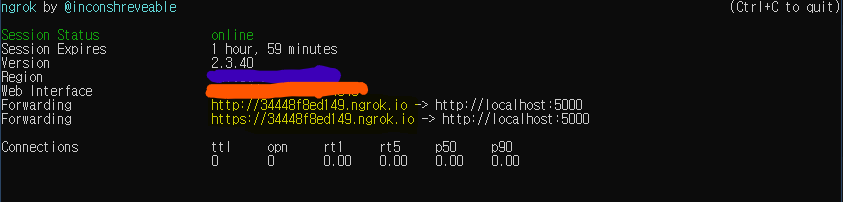
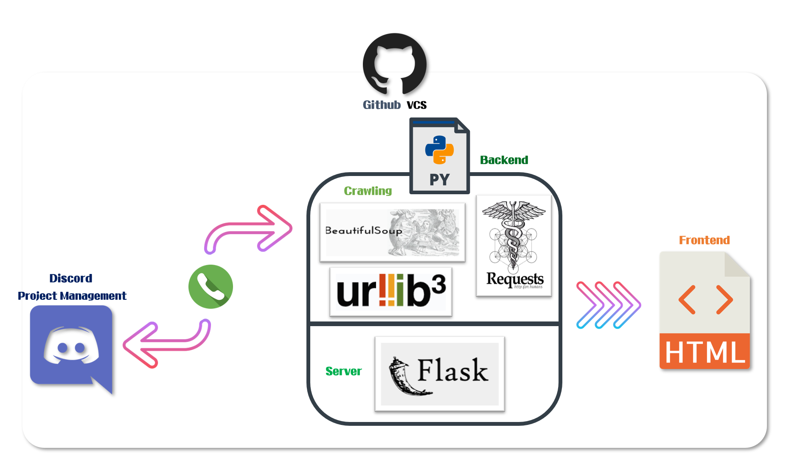

<p align="center">
  
</p>
<h1 align="center">Web_Crawling</h1>

___
<Br><Br>
# **📃 Introduce to Our Project!**
  - 해당 프로젝트는 **Team CMD**의 활동중 하나인 `SPTJ`의 결과물입니다.
  - ## 🏆 **Goal of Project**
     >> 원하는 웹상의 정보를 크롤링하여 무심코 지나쳤던 정보들의 참된 가치를 창출하고자 합니다!

     >> 대학의 퍼져있는 정보를 한눈에 알기쉽게 크롤링하여 보여줍니다!

   - 프로젝트에 대한 진행과정과 세부내용은 [**📚 Web_Crawling Wiki**](https://github.com/Team-CMD/SPTJ_Web-Crawling/blob/main/wiki/Home.md)를 확인해주세요! :)
___ 
<Br><Br><Br>

# **💼 About Team**
  ## 👇 **Cowork Position** 👇
   | Category | Position | Work | Profile |  
   | :----- | :----- | :----- | :---- |
   | SW Engineer | **Leader** | `Backend( Crawling )` | [sinbak's Github](https://github.com/sinbak) |  
   | SW Engineer | Mate | `Backend( Crawling )` | [HS980924's Github](https://github.com/HS98094) |  
   | SW Engineer | Mate | `Frontend( WebPage ), Backend( Server )` | [Jh9892's Github](https://github.com/jh9892) |  
   
___
<Br><Br><Br>
# **💻 How to See the project?**
  > **🤟 If you see our project, we have 2 ways! Follow the steps below to proceed.**
  ___
  - ## **☝ First!**
    1. Step 01.  
      - Write to the Issue in our project.  
        ```bash
        "I'm sorry... Later, We must update any other server and upload."
        USER : Please running to local server! 
        ```
    2. Step 02.  
      - The generated server url is provided.
        ```bash
        "I'm sorry... Later, We must update any other server and upload."
        ME : Our Project server url is "***********"! 
             Thank you for meet our results.
        ```
    
___

  - ## **✌ Second!**
    1. ### Step 01.  
      - Go to the `app/` path.
        ```bash
          > cd app
        ```
    3. ###  Step 02.  
      - Execute `ngrok.exe` and `app.py`, take the command.
        ```bash
        # app.py
          > flask run
        
        # ngrok.exe
          > ngrok.exe http 5000
        ```
    3. ### Step 03.
      - `Check to the generated url` and connect with Chrome
        

    4. ### Step 04.
      - If you want to disconnect our results, take below command
        ```bash
          Push "Ctrl + C" command twice! 
        ```

# **⚙ Programming Stacks** 

___ 

**`Copyright to Team CMD. and @JH9892, @sinbak, @HS980924. All creatures cannot be copied without permission.`**
